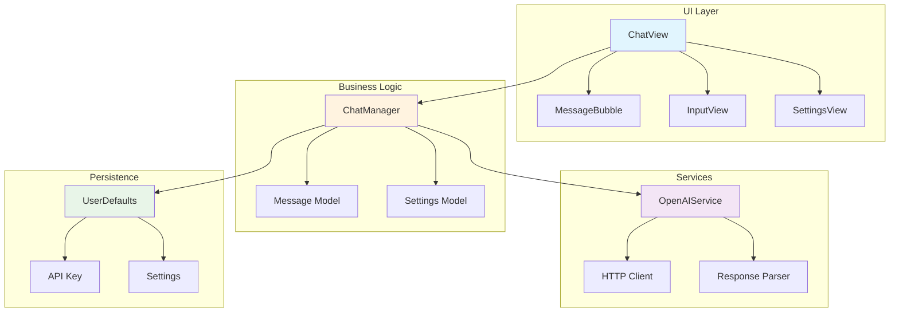
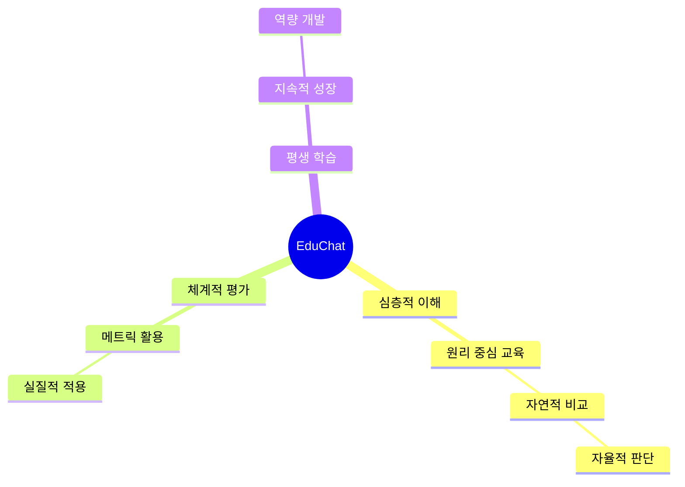

# EduChat 🤖📚

<div align="center">


**AI와 데이터 과학 분야의 개인 맞춤형 교육 챗봇**

*심층적 이해를 통한 자연스러운 비교·평가 능력 배양*

[🚀 설치 방법](#설치-및-실행) | [📖 사용 방법](#사용-방법) | [🏗️ 아키텍처](#️-아키텍처)

</div>

---

## 📋 목차

- [🎯 프로젝트 소개](#-프로젝트-소개)
- [✨ 주요 기능](#-주요-기능)
- [🛠️ 기술 스택](#️-기술-스택)
- [🏗️ 아키텍처](#️-아키텍처)
- [📦 설치 및 실행](#-설치-및-실행)
- [🎮 사용 방법](#-사용-방법)
- [📚 문서](#-문서)
- [📝 라이선스](#-라이선스)

---

## 🎯 프로젝트 소개

**EduChat**은 딥테크(AI/데이터) 교육을 위한 지능형 학습 시스템의 핵심 컴포넌트입니다.

블룸의 교육목표 최상위 목표를 전통교육과 ChatGPT 등보다 **10배 이상 효율적으로** 달성할 수 있는 검증 과정을 통해 개발되었습니다. 딥테크의 하위 모든 개념을 전문가가 설계한 컨텐츠로 제공하며, 개인화된 수준 체크, 최적 학습경로 추천, 맞춤 계획 수립, 실시간 테스트를 통해 완벽한 과외 형식을 구현합니다.

### 📅 개발 기간
- **총 기간**: 2025년 4월 ~ 9월 (현재까지)
- **EduChat 구현**: 2025년 9월 4일 ~ 9월 10일

### 👥 고객 페르소나
현재 지식 수준, 나이와 상관없이 딥테크 분야에 뛰어들고 싶은 열정과 인내심이 있는 사람. 기존의 교육체계는 자신에게 부족하다고 인지할 수 있는 사람.

---

## ✨ 주요 기능

### 🧠 핵심 교육 아키텍처
- **온톨로지 기반 계층적 개념 모델링**: 첨단 논문부터 기초 개념까지 구조화된 지식 그래프
- **블룸의 교육목표 기반 6단계 난이도 컨텐츠**: 인지 → 이해 → 적용 → 분석 → 평가 → 창조
- **개인화 알고리즘**: 사용자 지식 수준에 따른 최적 학습경로, 학습계획 자동 추천

### 🔄 듀얼 모드 시스템
- **일반모드**: 친근한 가이드, 기초 개념 + 자연스러운 비교 (100-200단어)
- **딥러닝 모드**: 심층적 교육 전문가, 계층적 개념 분석 + 사전 질문 시스템 (1500-2500단어)

### ❓ 지능적 사전 질문 시스템 (딥러닝 모드)
- **1단계**: "이 개념을 어떻게 심층적으로 분석하고 설명할지 계획을 말씀해주세요"
- **2단계**: "최종 응답을 어떤 방식으로 구성하고 싶으신가요"
- **결과**: 계획 기반 맞춤형 심층 분석 응답 생성

### 🎨 직관적인 UI/UX
- **SwiftUI 기반 네이티브 macOS 앱**
- **실시간 채팅 인터페이스**
- **세션 관리 및 채팅 기록**
- **가벼운 인사 자동 응답**

### ⚙️ 개인화 설정
- **OpenAI API 키 안전 관리**
- **모드 즉시 전환**
- **대화 컨텍스트 유지**

---

## 🛠️ 기술 스택

### Core Technologies
```swift
🔧 Swift 5.9+         // 메인 프로그래밍 언어
📱 SwiftUI            // UI 프레임워크
🖥️ macOS 13.0+        // 타겟 플랫폼
🤖 OpenAI GPT-5-nano  // AI 엔진 (비용 효율성 고려)
```

### AI/ML Technologies
```swift
🧠 온톨로지 & 지식 그래프  // 개념 계층 모델링
🔍 벡터 임베딩           // 의미 기반 검색 (계획 단계)
🎯 개인화 알고리즘        // 최적 학습경로 추천
```

### Architecture Components
```swift
🏛️ MVVM Pattern       // 아키텍처 패턴
🔄 Combine            // 반응형 프로그래밍
💾 UserDefaults       // 로컬 데이터 저장
🌐 URLSession         // 네트워크 통신
```

### Development Tools
```swift
🛠️ Xcode 15.0+        // IDE
📦 Swift Package Manager // 의존성 관리
🎨 SwiftUI Previews   // UI 미리보기
🧪 XCTest             // 유닛 테스트 (향후 구현 예정)
```

### Research & Design Tools
```swift
🎨 Figma AI           // UI/UX 디자인
💻 Cursor AI          // AI 지원 개발
🌐 Replit, Vercel     // 웹 개발 플랫폼
```

---

## 🏗️ 아키텍처

**MVVM 패턴 기반 클린 아키텍처**

```
EduChat/
├── EduChatApp.swift          # 앱 엔트리포인트
├── Chat/
│   ├── Models/               # 데이터 모델
│   ├── Views/                # UI 컴포넌트
│   └── ChatManager.swift     # 비즈니스 로직
└── Services/
    ├── OpenAIService.swift   # AI 통합
    └── Constants.swift       # 설정 상수
```

### 🔄 MVVM 플로우
**View → ViewModel → Model → Service**

---

## 📦 설치 및 실행

### 📋 요구사항
- macOS 13.0 이상
- Xcode 15.0 이상
- OpenAI API 키

### 🚀 설치 단계

1. **리포지토리 클론**
   ```bash
   git clone https://github.com/your-username/EduChat.git
   cd EduChat
   ```

2. **Xcode에서 프로젝트 열기**
   ```bash
   open EduChat.xcodeproj
   ```

3. **API 키 설정**
   - 앱 실행 후 ⚙️ 설정 버튼 클릭
   - OpenAI API 키 입력 (`sk-...` 형식)
   - 저장 버튼 클릭

4. **빌드 및 실행**
   - ⌘ + R 키로 빌드 실행
   - 또는 Xcode의 ▶️ 버튼 클릭

### ⚠️ 주의사항
- **API 키 보안**: 실제 배포 시 Keychain 사용 권장
- **네트워크 연결**: OpenAI API 호출을 위해 인터넷 연결 필요
- **토큰 사용량**: 학습모드에서 더 많은 토큰 소비

---

## 🎮 사용 방법

### 💬 기본 사용법

1. **첫 실행 시 환영 메시지 표시**
   ```
   🤖 EduChat에 오신 것을 환영합니다!
   저는 AI와 데이터 과학 분야의 전문가입니다.
   ```

2. **일반모드 사용**
   - 간단한 질문: "머신러닝이 뭐야?"
   - 친근한 답변 + 기초 원리 설명 (100-200단어)

3. **딥러닝 모드 사용**
   - 📚 토글 ON → 새 세션 생성
   - 웰컴 메시지: "안녕하세요, 자세히 알고싶은 AI/데이터 관련내용이 있으면 말씀해주세요"
   - 사용자가 개념 질문 → **사전 질문 2단계** 시작

### 🎛️ 모드별 차이점

#### 일반모드 예시
```
📖 정의: 머신러닝은 데이터로부터 패턴을 학습하는 알고리즘
💡 예시: 스팸 메일 필터링
🔄 차이점: 규칙 기반 vs 데이터 기반 접근
🚀 팁: 간단한 프로젝트부터 시작하세요
```

#### 학습모드 예시
```
🧠 기술 원리의 본질적 이해
머신러닝의 핵심은 최적화 문제입니다...

🔍 개념의 계층적 심층 분석
표면 → 원리 → 수학 → 구현

💡 원리 기반 실질적 적용
원리를 이해하면 자연스럽게 비교·평가 가능

🔧 구현 메커니즘의 원리적 이해
수학적 원리가 실제 코드로 구현되는 과정
```

---

## 📚 상세 문서

### 📖 아키텍처 문서
- [**🏗️ 시스템 아키텍처**](docs/architecture.md) - MVVM 패턴, 데이터 플로우, 성능 최적화
- [**🔄 사용자 플로우**](docs/user_flow.md) - 사용자 경험, 상호작용 패턴, 성장 메트릭
- [**🎓 교육적 효과**](docs/educational_impact.md) - 비고츠키 목표 실현, 학습 효과 분석

### 📊 다이어그램 모음

#### 시스템 아키텍처 다이어그램


#### 교육 목표 실현 메커니즘


## 📚 문서

- **[🏗️ 시스템 아키텍처](docs/architecture.md)** - MVVM 패턴, 데이터 플로우, 성능 최적화
- **[🔄 사용자 플로우](docs/user_flow.md)** - UX/UI 설계, 사용자 경험 분석
- **[🎓 교육적 효과](docs/educational_impact.md)** - 비고츠키 목표 실현, 학습 방법론

## 📈 Lessons Learned (개발 과정에서의 교훈)

### 💡 기술적 교훈
- **EduChat 앱의 한계**: 대화기록의 딥러닝 사전질문 단계에서 사용자 상태 벡터임베딩 기반 개념 피라미드 모델링을 구현하지 못함 (시간/능력/인력 부족)
- **모델 선택의 딜레마**: GPT-5-nano는 비용 효율적이지만, 최고 성능 LLM부터 실험하는 것이 이상적
- **LLM 제어 방식**: 시스템 프롬프트 + 하드코딩 외에 오픈소스 모델 직접 제어 또는 강화학습 파인튜닝 필요

### 🎯 방법론적 교훈
- **데이터 분석의 함정**: "분석을 위한 분석"이 아닌 목적 중심 접근 필요
- **학습 방향성 평가**: 올바른 학습 방향을 측정하는 구체적인 방법론 개발 필요
- **피드백 시스템**: 동료평가, 전문가 피드백, 사용자 피드백으로 응답 품질 검증 필요

### 🚀 미래 개선 방향
- **벡터 임베딩 구현**: 사용자 상태 기반 개인화된 학습경로 추천
- **데이터 분석 심층화**: 정형데이터부터 시작하는 단계적 접근
- **LLM 성능 최적화**: 최고 성능 모델 실험 및 파인튜닝
- **교육학 통합**: 블룸의 교육목표 기반 체계적 평가 시스템

---

## 📝 라이선스

이 프로젝트는 MIT 라이선스 하에 공개되어 있습니다.

```
MIT License

Copyright (c) 2024 딥테크 교육 시스템 개발자

Permission is hereby granted, free of charge, to any person obtaining a copy
of this software and associated documentation files (the "Software"), to deal
in the Software without restriction, including without limitation the rights
to use, copy, modify, merge, publish, distribute, sublicense, and/or sell
copies of the Software, and to permit persons to whom the Software is
furnished to do so, subject to the following conditions:

The above copyright notice and this permission notice shall be included in all
copies or substantial portions of the Software.
```

---

<div align="center">

**EduChat** - 딥테크 교육을 위한 지능형 학습 시스템

*블룸의 교육목표 최상위 목표를 10배 효율적으로 달성하는 AI 교육 플랫폼*

### 🎯 프로젝트 동기
딥테크 진입을 위한 5개월 독학 경험에서 느린 학습 속도의 한계를 체감하고,
팔란티어의 구조적 영감을 받아 개발을 시작했습니다.

### 🌟 사회적 가치
- **교육 격차 해소**: 중학생이라도 고등학교-대학 교육을 기다리지 않고 즉시 딥테크 진입 가능
- **노동시장 다양성**: 40대 성인들도 기존 경력을 바탕으로 빠르게 딥테크 분야 전환 가능

⭐ [GitHub](https://github.com/your-username/EduChat) | 📧 [Contact](#)

*Made with ❤️ and SwiftUI*

</div>
