# EduChat 아키텍처 상세 문서

## 🏗️ 시스템 아키텍처 개요

### MVVM 패턴 기반 아키텍처

```
┌─────────────────┐    ┌─────────────────┐    ┌─────────────────┐
│   ChatView      │    │  ChatManager    │    │ OpenAIService   │
│   (View)        │◄──►│  (ViewModel)    │◄──►│   (Service)     │
│                 │    │                 │    │                 │
│ • UI 표시       │    │ • 상태 관리     │    │ • API 통신      │
│ • 사용자 입력   │    │ • 비즈니스 로직 │    │ • 응답 처리     │
│ • 이벤트 처리   │    │ • 데이터 변환   │    │ • 에러 처리     │
└─────────────────┘    └─────────────────┘    └─────────────────┘
         ▲                       ▲                       ▲
         │                       │                       │
         └───────────────────────┼───────────────────────┘
                                 │
                    ┌─────────────────┐
                    │   UserDefaults  │
                    │  (Persistence)  │
                    │                 │
                    │ • API 키 저장   │
                    │ • 설정 저장     │
                    │ • 대화 기록     │
                    └─────────────────┘
```

## 🔄 데이터 플로우

### 1. 사용자 입력 → AI 응답

```mermaid
sequenceDiagram
    participant U as User
    participant V as ChatView
    participant VM as ChatManager
    participant S as OpenAIService
    participant A as OpenAI API

    U->>V: 메시지 입력
    V->>VM: sendMessage()
    VM->>VM: 메시지 검증
    VM->>S: generateReply()
    S->>A: HTTP 요청
    A-->>S: JSON 응답
    S-->>VM: 처리된 응답
    VM-->>V: UI 업데이트
    V-->>U: 응답 표시
```



### 2. 모드 전환 플로우

```mermaid
stateDiagram-v2
    [*] --> 일반모드
    일반모드 --> 딥러닝모드: 토글 ON
    딥러닝모드 --> 일반모드: 토글 OFF

    일반모드 --> 일반모드: 친근한 응답
    딥러닝모드 --> 딥러닝모드: 사전 질문 → 심층 분석
```



### 3. 딥러닝 모드 사전 질문 플로우

```mermaid
flowchart TD
    A[사용자 질문] --> B[딥러닝 모드 토글 ON]
    B --> C[새 세션 생성]
    C --> D[웰컴 메시지 표시]
    D --> E[1단계: 분석 계획 수립]
    E --> F[사용자 계획 답변]
    F --> G[2단계: 응답 구성 방식]
    G --> H[사용자 구성 답변]
    H --> I[최종 심층 분석 생성]
```



## 📊 모드별 응답 구조

### 일반모드 응답 구조
```
📖 정의 (기초 원리 포함)
   ├── 기본 개념 설명
   ├── 간단한 원리 설명
   └── 실용적 맥락

💡 예시 (실제 적용 사례)
   ├── 구체적인 사용 사례
   ├── 결과 설명
   └── 실질적 효과

🔄 차이점 (기본적 비교)
   ├── 유사 개념과의 차이
   ├── 장단점 비교
   └── 선택 기준

🚀 팁 (추가 학습 제안)
   ├── 실천 방법
   ├── 학습 방향
   └── 다음 단계
```

### 딥러닝 모드 응답 구조
```
🧠 개념의 핵심 본질 파악
   ├── 비유를 통한 직관적 설명
   ├── 기본 개념 정의
   └── 핵심 원리 소개

🔍 표면과 관계성 분석
   ├── 기초 개념 이해
   ├── 유사 개념과의 관계
   └── 상대적 위치 파악

⚙️ 원리와 구현 방법
   ├── 이론적 기반 설명
   ├── 실제 적용 기술
   └── 구현 전략

🌐 응용과 활용 분야
   ├── 다양한 분야 적용
   ├── 실무 사례
   └── 확장 가능성

📚 역사적 발전과 맥락
   ├── 발전 과정
   ├── 진화 역사
   └── 현재 의미

⚖️ 한계와 미래 전망
   ├── 제약사항 분석
   ├── 개선 방향
   └── 미래 발전
```

## 🎯 교육 목표 달성 메커니즘

### 비고츠키 교육 목표 실현

```mermaid
mindmap
  root((비고츠키 목표))
    비교 능력
      원리 이해
        자연적 비교
          자율적 판단
    평가 능력
      심층 분석
        체계적 평가
          메트릭 활용
    자율 학습
      근본적 사고
        평생 학습
          지속적 성장
```



## 🔧 기술적 구현 세부사항

### 상태 관리
```swift
class ChatManager: ObservableObject {
    @Published var messages: [Message] = []
    @Published var isLoading: Bool = false
    @Published var errorMessage: String?
    @Published var fullStudyMode: Bool = false
}
```

### AI 서비스 계층
```swift
class OpenAIService {
    private let defaultModel = "gpt-5-nano"

    func generateReply(prompt: String, isStudyMode: Bool = false) async throws -> String {
        let apiKey = getAPIKey()
        guard !apiKey.isEmpty && apiKey.hasPrefix("sk-") else { throw OpenAIError.missingAPIKey }

        let url = URL(string: "https://api.openai.com/v1/chat/completions")!
        var request = URLRequest(url: url)
        request.timeoutInterval = isStudyMode ? 300 : 60
        request.httpMethod = "POST"
        request.setValue("Bearer \(apiKey)", forHTTPHeaderField: "Authorization")
        request.setValue("application/json", forHTTPHeaderField: "Content-Type")

        // 딥러닝 모드용 상세 시스템 프롬프트 적용
        let messages = createMessagesForMode(prompt, isStudyMode)
        let body = ["model": defaultModel, "messages": messages] as [String : Any]
        request.httpBody = try JSONSerialization.data(withJSONObject: body, options: [])

        let (data, _) = try await URLSession.shared.data(for: request)
        let decoded = try JSONDecoder().decode(OpenAIChatResponse.self, from: data)
        guard let content = decoded.choices.first?.message.content else {
            throw OpenAIError.emptyResponse
        }
        return content
    }
}
```

### UI 컴포넌트 계층
```swift
struct ChatView: View {
    @ObservedObject var chatManager: ChatManager

    var body: some View {
        VStack {
            ScrollView { /* 메시지 리스트 */ }
            InputView(chatManager: chatManager)
        }
    }
}
```

## 📈 성능 최적화

### 메모리 관리
- **메시지 제한**: 최근 6개 메시지만 유지
- **이미지 최적화**: 필요시 지연 로딩
- **캐싱 전략**: 자주 사용하는 데이터 캐시

### 네트워크 최적화
- **요청 병합**: 유사 요청 통합
- **응답 캐싱**: 동일 질문 캐시
- **타임아웃**: 60초 제한
- **재시도 로직**: 네트워크 실패시 자동 재시도

### UI 성능
- **지연 렌더링**: 보이는 메시지만 렌더링
- **애니메이션 최적화**: 60fps 유지
- **메모리 누수 방지**: 순환 참조 제거
