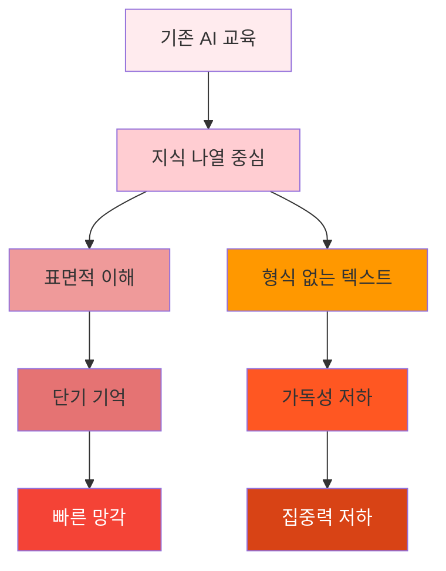
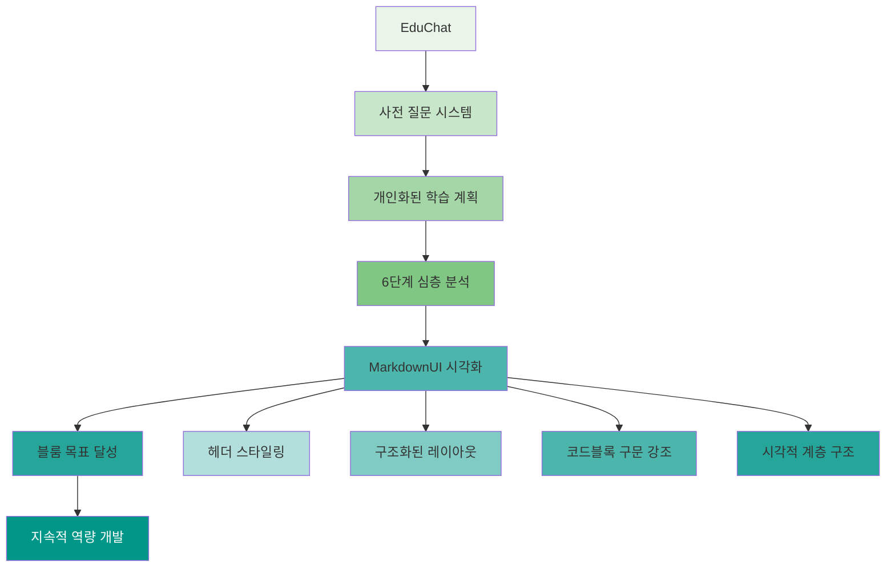
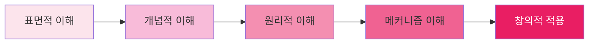
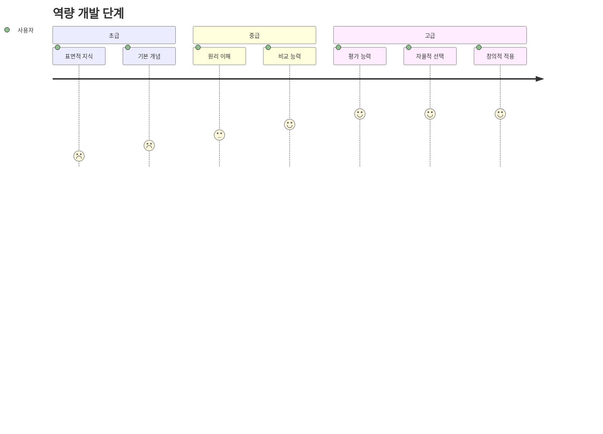
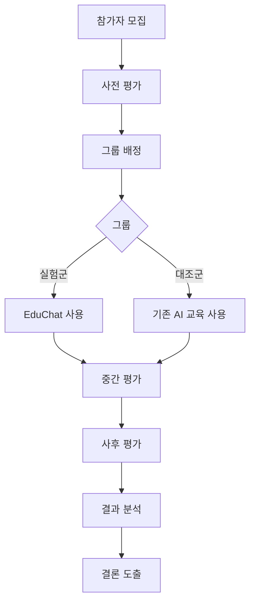

# EduChat 교육적 효과 분석

## 🎯 교육 목표 달성 메커니즘

### 비고츠키 교육 목표 + 블룸의 교육목표 통합

| 목표 | 전통적 접근 | EduChat 접근 | 블룸 단계 | 예상 효과 |
|:-----|:------------|:-------------|:----------|:----------|
| **비교 능력** | "A와 B를 비교하세요" | "원리를 이해하면 자연스럽게 비교하게 됩니다" | 분석/평가 | ⭐⭐⭐⭐⭐ |
| **평가 능력** | "이렇게 평가하세요" | "근본적 차이를 파악하면 체계적으로 평가하게 됩니다" | 평가/창조 | ⭐⭐⭐⭐⭐ |
| **자율 학습** | "이 선택지가 좋습니다" | "심층적 이해가 자발적 판단을 유도합니다" | 적용/창조 | ⭐⭐⭐⭐⭐ |

### 사전 질문 시스템의 교육적 효과

**1단계: 분석 계획 수립**
- 사용자가 스스로 학습 방향을 설계하도록 유도
- 블룸의 "분석" 단계 촉진
- 주도적 학습 습관 형성

**2단계: 응답 구성 방식 결정**
- 최종 결과물의 구조를 사전에 계획
- 블룸의 "창조" 단계 유도
- 체계적 사고력 향상

## 📊 비교 분석: 기존 AI 교육 vs EduChat

### 기존 AI 교육 챗봇의 한계


### EduChat의 혁신적 접근 (MarkdownUI 강화)


## 🎓 학습 효과 측정 프레임워크

### 1. 인지적 깊이 (Cognitive Depth)


### 2. 역량 개발 단계



## 🔬 실험 설계 및 방법론

### 연구 가설
1. **원리 중심 교육**이 **지식 전달 교육**보다 더 효과적이다
2. **자연적 학습 유도**가 **강제적 학습**보다 더 지속적이다
3. **심층적 이해**가 **표면적 이해**보다 더 응용력이 높다

### 실험 설계


### 측정 변수
- **독립변수**: EduChat vs 기존 AI 교육
- **종속변수**: 비교·평가 능력, 학습 지속성, 응용력
- **통제변수**: 사용자 배경, 사용 시간, 개념 난이도

## 💡 혁신적 교육 메소드

### 1. 사전 질문 기반 학습 설계
```
전통적: "이걸 배우세요" → 강제적
EduChat: "어떻게 분석하고 설명할지 스스로 계획하세요" → 자발적 학습 설계
```

### 2. 6단계 계층적 개념 분석
```
표면 → 관계성 → 원리 → 구현 → 응용 → 역사/한계
각 단계가 점진적으로 깊이를 더해가는 교육적 구조
```

### 3. 계획 → 실행 → 평가 사이클
```
1단계 계획 수립 → 2단계 응답 구성 → 3단계 심층 분석 → 4단계 평가
사용자가 교육 과정을 스스로 설계하고 실행하는 완전한 학습 사이클
```

## 🌟 차별화된 강점

### 기존 솔루션 대비 우위
| 측면 | 기존 AI 교육 | EduChat |
|:-----|:-------------|:--------|
| **교육 목표** | 지식 전달 | 역량 개발 |
| **학습 방식** | 강제적 | 자발적 |
| **지속성** | 단기적 | 장기적 |
| **응용력** | 제한적 | 실질적 |
| **자율성** | 낮음 | 높음 |

### 독특한 가치 제안
1. **비고츠키 목표 실현**: 최상위 교육 목표 직접 달성
2. **자율적 역량 배양**: 강요하지 않고 스스로 성장
3. **MarkdownUI 시각화**: 구조화된 콘텐츠로 학습 효율성 극대화
4. **딥테크 전문성**: AI/데이터 분야 특화
5. **지속적 성장**: 평생 학습 습관 형성

### MarkdownUI 교육적 효과
- **시각적 계층 구조**: 헤더/리스트로 개념 구조 명확화
- **코드블록 구문 강조**: 프로그래밍 학습 시 가독성 향상
- **테이블/링크 지원**: 복잡한 정보 체계적 전달
- **반응형 디자인**: 다양한 디바이스에서 최적 학습 경험
- **접근성 향상**: 스크린 리더 지원으로 포용성 확대

## 🚀 미래 확장 가능성

### 교육적 확장
- **멀티모달 학습**: 텍스트 + 시각화 + 상호작용
- **개인화된 학습 경로**: 사용자 수준에 맞는 난이도 조정
- **피어 러닝**: 사용자 간 지식 공유 플랫폼
- **평가 시스템**: 학습 효과 자동 측정

### 기술적 확장
- **AI 튜터링**: 더 정교한 개인 맞춤 교육
- **실시간 피드백**: 학습 과정 중 즉각적 코칭
- **진단 평가**: 사용자 역량 자동 진단
- **예측 분석**: 학습 패턴 기반 미래 성과 예측

## 📊 임팩트 측정

### 사회적 영향
- **교육 평등**: 고품질 AI 교육의 대중화
- **진로 개발**: 더 나은 진학/취업/창업 선택
- **지식 경제**: AI 리터러시 향상

### 경제적 영향
- **생산성 향상**: 효율적인 학습으로 시간 절약
- **혁신 촉진**: 심층적 이해를 통한 창의성 증진
- **시장 창출**: AI 교육 시장 선도

---

*EduChat은 단순한 챗봇이 아닌, **교육 혁신의 실험적 플랫폼**입니다.*
