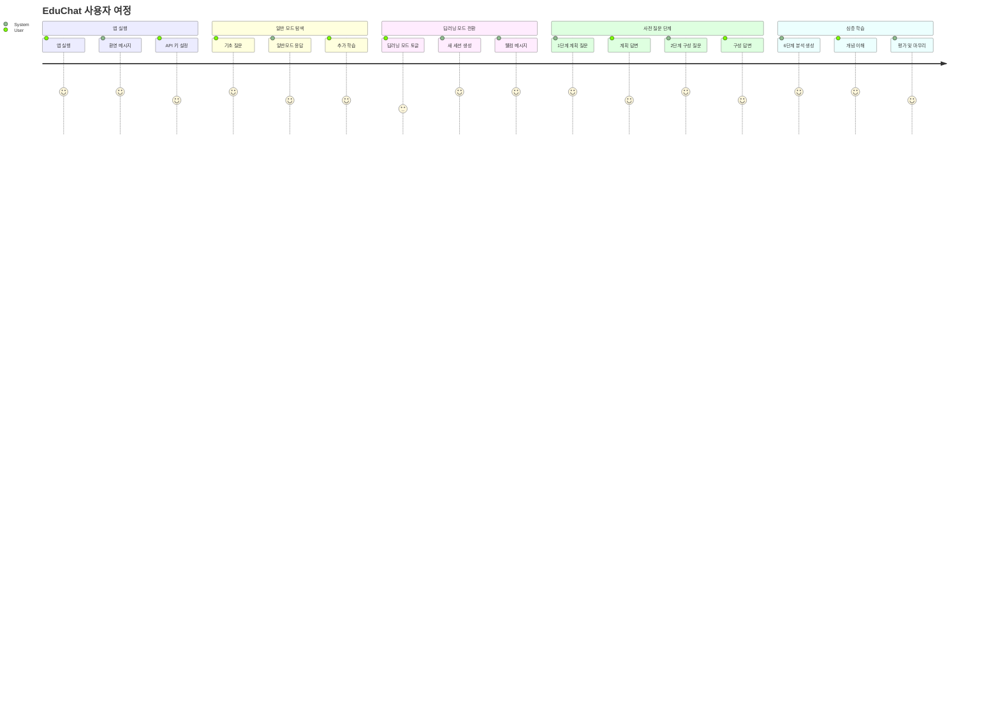
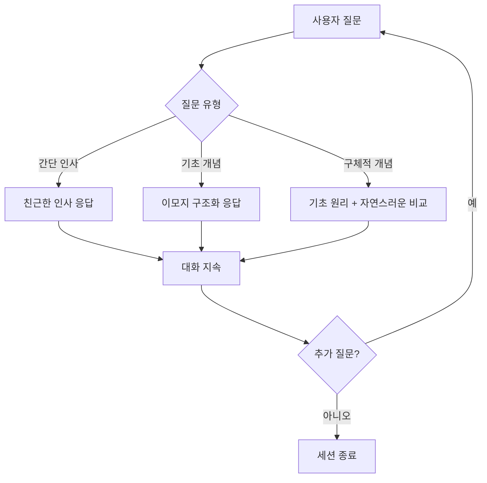
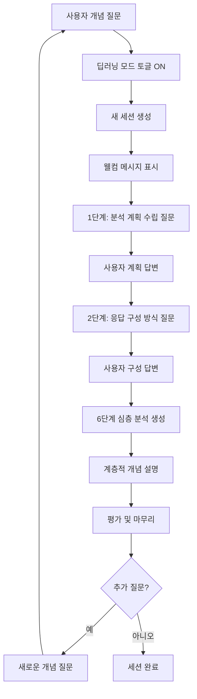
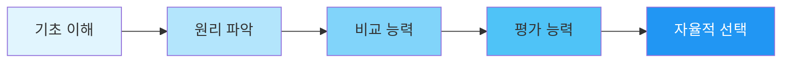
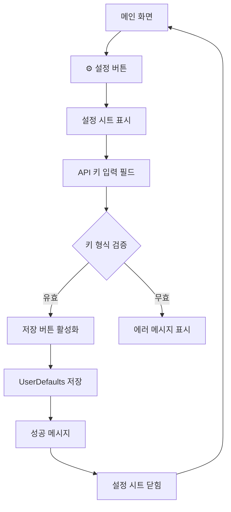
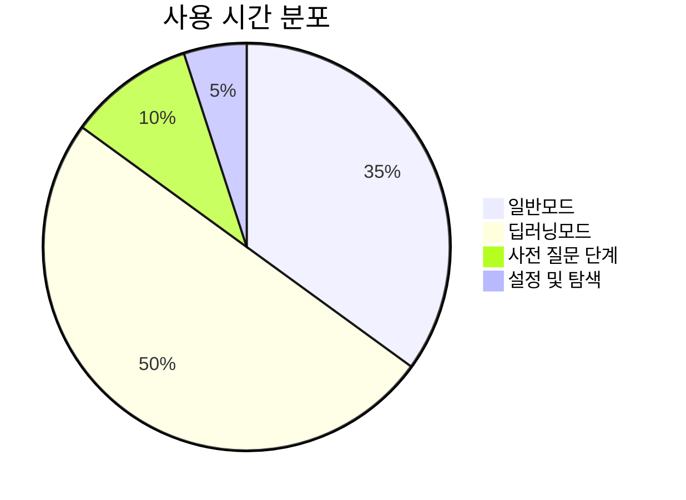
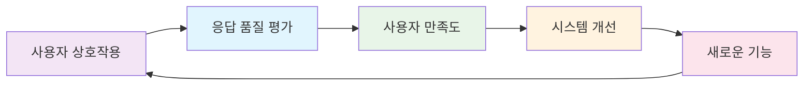

# EduChat 사용자 플로우

## 🚀 앱 시작부터 첫 대화까지



## 🎯 모드별 상호작용 패턴

### 일반모드 사용자 플로우


### 딥러닝 모드 사용자 플로우


## 📊 교육 효과 추이

### 학습 곡선 그래프 (개념적 표현)
```
학습 효과
     ^
     │
    ⭐│
     │        📚 학습모드
     │     🌟
     │   🔄
    ⭐│ 🔄   일반모드
     │🔄  🌟
     │ 🔄 📚
    ⭐│🔄 🌟 📚
     └───────────────────►
       시간 (사용 빈도)
```

### 역량 개발 단계


## 🎨 UI/UX 플로우

### 메인 화면 상호작용 (MarkdownUI 렌더링 적용)
```
┌─────────────────────────────────────┐
│           EduChat 🤖📚              │
├─────────────────────────────────────┤
│                                     │
│  🤖 환영 메시지 (첫 실행시)         │
│                                     │
│  💬 사용자 메시지 버블              │
│  ┌─────────────────────────────┐    │
│  │사용자: 머신러닝이 뭐야?      │    │
│  └─────────────────────────────┘    │
│                                     │
│  🤖 AI 응답 (MarkdownUI 렌더링)    │
│  ┌─────────────────────────────────┐ │
│  │### 📖 비유를 통한 핵심 요약     │ │
│  │머신러닝은...                    │ │
│  │                                 │ │
│  │### 📚 개념의 역사               │ │
│  │역사적으로...                    │ │
│  └─────────────────────────────────┘ │
│                                     │
│  📚 사전 질문 단계 (딥러닝 모드)    │
│  1단계: 분석 계획 수립             │
│  2단계: 응답 구성 방식             │
│                                     │
├─────────────────────────────────────┤
│  ┌─────────────────────────────────┐ │
│  │ 💬 메시지 입력...              │ │
│  └─────────────────────────────────┘ │
│  📚 딥러닝 모드 [토글]             │
│  ⚙️ 설정 | ➕ 새 채팅               │
└─────────────────────────────────────┘
```

**MarkdownUI 렌더링 특징:**
- ✅ **헤더 자동 스타일링**: `# ## ###` → 실제 헤더 디자인
- ✅ **리스트 구조화**: `- * 1.` → 계층적 리스트
- ✅ **코드블록 구문 강조**: ```코드``` → 컬러링된 코드블록
- ✅ **볼드/이탤릭**: `**굵게**` `*기울임*` → 실제 스타일 적용
- ✅ **링크 지원**: `[텍스트](URL)` → 클릭 가능한 링크
- ✅ **테이블 렌더링**: 마크다운 테이블 → 실제 테이블

### 설정 화면 플로우


## 📈 사용자 성장 메트릭

### 학습 진척도 추적


### 역량 향상 지표
```mermaid
lineXY
    title 역량 개발 추이
    x-axis 시간 (일)
    y-axis 역량 점수 (0-100)
    line 일반모드 사용자
    line 딥러닝모드 사용자 (사전 질문 포함)
```

## 🔄 피드백 루프

### 지속적 개선 사이클

